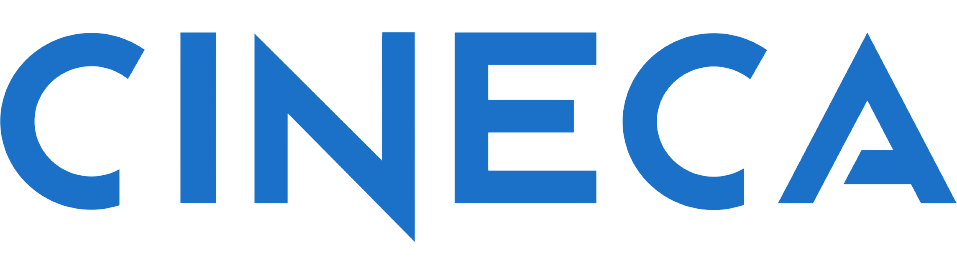

# Advanced parallel programming
#### Rodolfo Tolloi
### Built with: 

  
Homeworks and exercises from the course in Advanced Parallel Programming.
 Each exercise has its own directory and inside of it you'll find the code and the results of the benchmarking (if requested).
