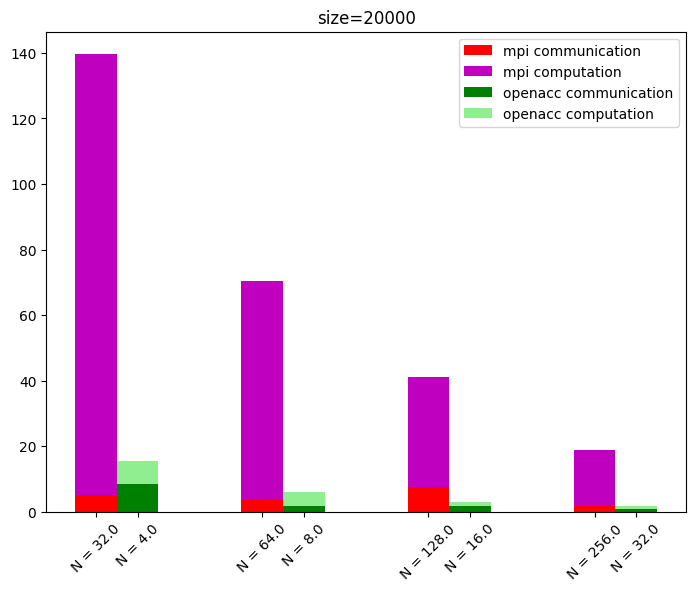

## Software Stack
For the openACC solution I used:
```
module load hpc-sdk
```
and for the MPI one:
```
module load spectrum_mpi/
```

## Some result
Code execution is severly slowed by the writing on file of the initial and final matrix. The function is not parallelized and for large size of the problem, the printing can take several minutes.

|    |   size |   n_proc_tot |   it |   total_time |   compute_time |   comm_time |
|---:|-------:|-------------:|-----:|-------------:|---------------:|------------:|
|  0 |  20000 |           32 | 1000 |     139.527  |       134.501  |     5.02508 |
|  1 |  20000 |           64 | 1000 |      70.5163 |        67.1103 |     3.40546 |
|  2 |  20000 |          128 | 1000 |      41.1231 |        33.6141 |     7.50846 |
|  3 |  20000 |          256 | 1000 |      18.6621 |        16.8322 |     1.82935 |
|  4 |  40000 |           32 | 1000 |     555.991  |       549.767  |     6.22345 |
|  5 |  40000 |           64 | 1000 |     279.884  |       274.526  |     5.35765 |
|  6 |  40000 |          128 | 1000 |     141.259  |       137.228  |     4.02967 |
|  7 |  40000 |          256 | 1000 |      71.6701 |        68.6364 |     3.03318 |
|  8 |  28000 |           32 | 1000 |     273.391  |       268.61   |     4.77999 |
|  9 |  28000 |           64 | 1000 |     137.531  |       134.086  |     3.44461 |
| 10 |  28000 |          128 | 1000 |      69.6555 |        66.947  |     2.70773 |
| 11 |  28000 |          256 | 1000 |      35.5687 |        33.433  |     2.13506 |

|    |   size |   n_proc_tot |   it |   total_time |   compute_time |   comm_time |
|---:|-------:|-------------:|-----:|-------------:|---------------:|------------:|
|  0 |  20000 |            4 | 1000 |     15.7929  |       7.02993  |    8.54333  |
|  1 |  20000 |            8 | 1000 |      6.16761 |       4.29319  |    1.75451  |
|  2 |  20000 |           16 | 1000 |      3.01525 |       1.2511   |    1.70161  |
|  3 |  20000 |           32 | 1000 |      1.86085 |       0.885237 |    0.940177 |
|  4 |  40000 |            8 | 1000 |     38.8949  |      34.0907   |    4.36605  |
|  5 |  40000 |           16 | 1000 |     17.8192  |      11.6054   |    5.99313  |
|  6 |  40000 |           32 | 1000 |      7.81047 |       5.19746  |    2.4947   |
|  7 |  28000 |            4 | 1000 |     37.1887  |      24.5527   |   12.2029   |
|  8 |  28000 |            8 | 1000 |     16.7189  |      10.9472   |    5.55605  |
|  9 |  28000 |           16 | 1000 |      6.76003 |       4.84801  |    1.80296  |
| 10 |  28000 |           32 | 1000 |      3.03168 |       1.14228  |    1.83314  |

<figure>
  
</figure>

<figure>
  
</figure>