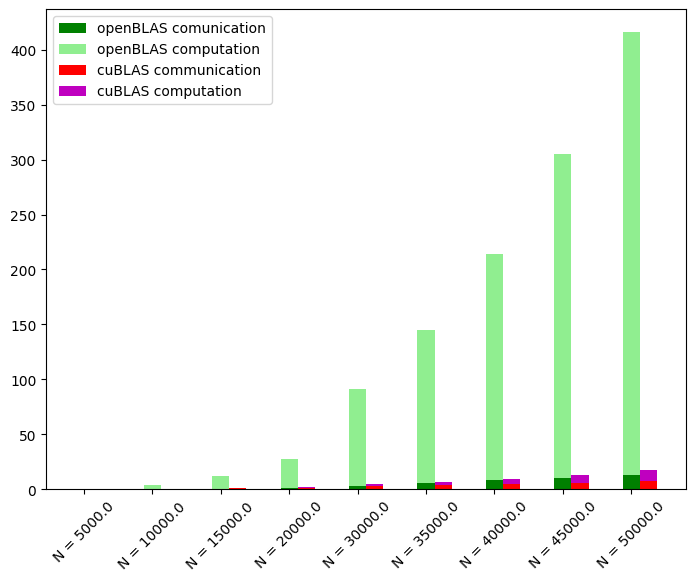

# Matrix multiplication
The objective of this assignment is to implement the matrix multiplication in 3 different ways:
1. Naive multiplication: just some for loops on the data
2. Use the of openblas dgemm
3. Use of the cublas dgemm 

In all these cases, the matrices are distributed among one direction. The code is capable of calculate the optimal distribution among the n process, so every size of the matrices is acceptable.  
The M100 computing nodes are equipped with 4 GPUs, each with 16 GB of VRAM. So, the maximum size of the problem should be:
```math
\sqrt\frac{\text{Total memory}}{\text{\#of matrices allocated * byte size of double}} = \sqrt\frac{4*16*10^9}{3*8} = 51639
```
NOTE: In order to simplify the debugging, the code will multiply a matrix of random doubles with the identity matrix of the same size.

## Software Stack
For this solution I used the following modules on Marconi100:
1. profile/base
2. autoload   
3. gnu/8.4.0 
4. openblas/0.3.9--gnu--8.4.0   
5. cuda/11.0   
6. spectrum_mpi/10.4.0--binary  

Secondo me la max matrices è 44000*44000: questo perchè sono 3 matrici (A, B e C)

## How to run the code
I created a [launcher.sh](launcher.sh) file but it's useful only in some occasion. For a more general command use:
```
make run N=<size> CORES=<number of total process> n_socket=<# of process for each socket> n_node=<#of process for each node> compilation=<dgemm or gpu> flags=<debug>
```
The are some default values: n_socket = 16, n_node = 32. If the compilation variable is not specified, the naive versione will be compiled.

## Some Results:
The code has a "warmup time" where it generates all the numbers inside the matrices, so the actual running time is way longer than the actual computation.

<figure>
  <figcaption>1 Node</figcaption>
  
</figure>

<figure>
  <figcaption>2 Node</figcaption>
  
</figure>

<figure>
  <figcaption>4 Node</figcaption>
  
</figure>

<figure>
  <figcaption>8 Node</figcaption>
  
</figure>


<figure>
  <figcaption>Scalability for N=45000</figcaption>
  
</figure>

<figure>
  <figcaption>Scalability (OpenBLAS) for N=45000</figcaption>
  
</figure>

<figure>
  <figcaption>Scalability (cuBLAS) for N=45000</figcaption>
  
</figure>